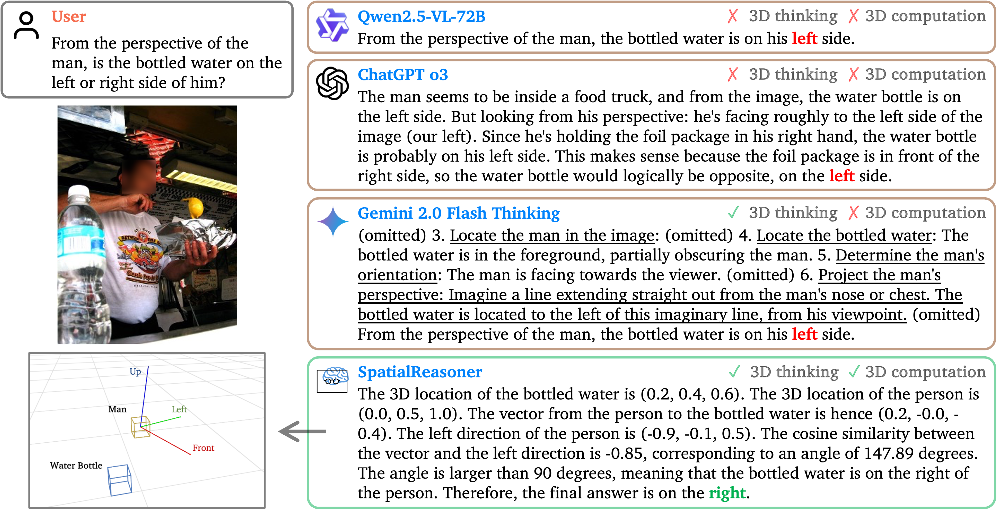

# SpatialReasoner




## Installation

```bash
conda create -n spatial_reasoner python=3.11 -y && conda activate spatial_reasoner
pip3 install -e ".[dev]"
pip3 install flash-attn --no-build-isolation
pip3 install qwen_vl_utils
```


## Training 


### Download Training Data 
To download the Open Images Dataset, please run:

```bash
curl "https://s3.amazonaws.com/aws-cli/awscli-bundle.zip" -o "awscli-bundle.zip"
unzip awscli-bundle.zip
./awscli-bundle/install -b ~/bin/aws
aws s3 --no-sign-request sync s3://open-images-dataset/train [target_dir/train]
```
For more details, please refer to [open-images-dataset](https://github.com/cvdfoundation/open-images-dataset?tab=readme-ov-file#download-images-with-bounding-boxes-annotations).


### Training 
- SpatialReasoner-SFT
```bash
bash local_scripts/spatialreasoner-sft.sh
```

- SpatialReasoner-Zero
```bash
bash local_scripts/spatialreasoner-zero.sh
```

- SpatialReasoner
```bash
bash local_scripts/spatialreasoner.sh
```

## Evaluation
### Download Evaluation Data

```sh
mkdir ./data && cd ./data

# 3DSRBench
wget https://huggingface.co/datasets/ccvl/3DSRBench/resolve/main/3dsrbench_v1_vlmevalkit_circular.tsv

# CV-Bench-3D
wget https://huggingface.co/datasets/ccvl/SpatialReasonerEval/resolve/main/CV-Bench-3D.tsv
```

### Inference

- SpatialReasoner-SFT
```bash
bash local_scripts/infer_spatialreasoner-sft.sh
```

- SpatialReasoner-Zero
```bash
bash local_scripts/infer_spatialreasoner-zero.sh
```

- SpatialReasoner
```bash
bash local_scripts/infer_spatialreasoner.sh
```

### Evaluation

We use our inference script for multi-batch inference and use [VLMEvalKit](https://github.com/open-compass/VLMEvalKit) for evaluation. Please move the output file from `YOUR_OUTPUT_PATH` to VLMEvalKit and follow their instruction for evluation. Note that the final score for 3DSRBench will require additional calculation using [compute_3drbench_results_circular.py](https://huggingface.co/datasets/ccvl/3DSRBench/blob/main/compute_3drbench_results_circular.py)